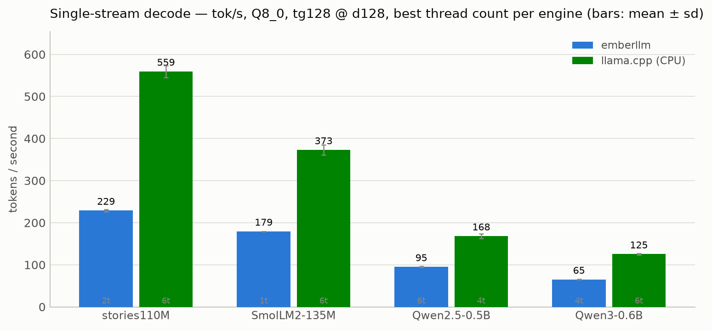

# emberllm

A CPU-only LLM inference engine written from scratch in **~3,300 lines of
dependency-free C11**. One `Makefile`, a ~2-second build, a **123 KB binary**
(it links nothing but libSystem) that holds a real chat with Qwen3-0.6B,
serves an **OpenAI-compatible API**, and embeds as a C library or from Python
via ctypes.

And because "fast for a from-scratch engine" is meaningless without a
reference: emberllm is **benchmarked head-to-head against
[llama.cpp](https://github.com/ggml-org/llama.cpp)** — same machine, same
upstream weights, same measurements. The honest result: llama.cpp's CPU
backend is **1.8–2.5× faster at decoding** and **5–7× faster at prompt
processing**. What emberllm offers is the other side of that trade: **about
half of llama.cpp's single-stream decode speed from 1/130th as much code** —
an engine you can read in an afternoon, understand completely, and embed
anywhere a C compiler goes.

<picture>
  <source media="(prefers-color-scheme: dark)" srcset="docs/assets/decode-dark.png">
  
</picture>

| model (Q8_0) | emberllm | llama.cpp (CPU) | llama.cpp (Metal GPU) |
|---|---:|---:|---:|
| stories110M | 229 tok/s | **559 tok/s** | 436 tok/s |
| SmolLM2-135M | 179 tok/s | **373 tok/s** | 245 tok/s |
| Qwen2.5-0.5B | 95 tok/s | **168 tok/s** | 143 tok/s |
| Qwen3-0.6B | 65 tok/s | 125 tok/s | **130 tok/s** |

*Single-stream decode, 128 tokens at a 128-token context depth, mean of 5
runs; the CPU engines at their best thread count from a 1–8 sweep, Metal
measured at one standard configuration. Apple M1 Pro, macOS, llama.cpp release
`b10068`. Note the Metal column: on three of these four small models,
llama.cpp's own **CPU** decode beats its GPU. Full methodology, thread-scaling
curves, prefill numbers, raw JSON, and every configuration where emberllm
loses:
**[notebooks/benchmark_vs_llamacpp.ipynb](notebooks/benchmark_vs_llamacpp.ipynb)**.*

```
$ ./ember chat models/qwen3-0.6b-q8.ember --threads auto

> Write a haiku about winter.
A frost-kissed sky
Whispers of snow on the wind,
A quiet winter's embrace.
```

## Quickstart

```sh
git clone https://github.com/LeandHadergjonaj/emberllm && cd emberllm
make                              # ~2 s; uses NEON/AVX where present

# a 110M TinyStories model — MIT-licensed, fun, and fast
./tools/download.sh stories110M   # fetches weights, converts, quantizes to Q8_0
./ember generate models/stories110M-q8.ember -p "Once upon a time"

# a real chat model — Qwen3-0.6B (needs: pip install numpy safetensors)
./tools/download.sh qwen3-0.6b
./ember chat models/qwen3-0.6b-q8.ember --threads auto
```

No weights are committed; `download.sh` fetches them from Hugging Face and the
converter turns them into a single self-describing `.ember` file. Every
subcommand documents itself: `ember generate --help`, `ember chat --help`, etc.
A [VHS](https://github.com/charmbracelet/vhs) tape for the demo GIF lives at
[`bench/demo.tape`](bench/demo.tape).

## Run it as a server

`ember serve` is a drop-in local backend for anything that speaks the OpenAI
API — chat UIs, editor plugins, agent frameworks — with no extra dependencies
(the HTTP server and JSON reader are hand-rolled in
[`src/server.c`](src/server.c) and [`src/json.c`](src/json.c)).

```sh
ember serve models/qwen3-0.6b-q8.ember --port 8080 --threads auto
```

```sh
curl http://127.0.0.1:8080/v1/chat/completions -H 'Content-Type: application/json' -d '{
  "messages": [{"role": "user", "content": "Write a haiku about winter."}],
  "stream": true
}'
```

It exposes **`POST /v1/chat/completions`** (with SSE streaming), **`GET
/v1/models`**, and **`GET /health`**; requests honour `temperature`, `top_p`,
`top_k`, `max_tokens`, `stop`, `repeat_penalty`, and
`presence/frequency_penalty`. The OpenAI Python client works by pointing
`base_url` at it. Scope is deliberately **single-stream** — one request at a
time, same forward pass as the CLI, ChatML prompt template (so it targets
ChatML chat models like Qwen3).

## Embed it (library + Python)

The engine is also a library. `make lib` builds `libember.a` and `libember.so`
from the same core the CLI uses (the `ember` binary is just `main.o` linked
against the library), so the ~15-function C API in [`src/ember.h`](src/ember.h)
is a complete embedding surface: load, tokenize, prefill/forward, sample.

Python bindings ship in [`bindings/python`](bindings/python) — pure `ctypes`,
no Python dependencies:

```python
from emberllm import Ember
with Ember("models/stories110M-q8.ember") as m:
    print(m.generate_str("Once upon a time", max_tokens=64, temperature=0.8))
```

```sh
make lib
python3 bindings/python/example.py models/stories110M-q8.ember "Once upon a time"
```

New to the code? [ARCHITECTURE.md](ARCHITECTURE.md) traces a token through the
engine; [CONTRIBUTING.md](CONTRIBUTING.md) has an "add your own model" guide.

## Sampling and reproducibility

`generate` and `chat` expose the standard sampling controls:

```sh
ember generate model.ember -p "..." \
  -t 0.8 --top-k 40 --top-p 0.95 --min-p 0.05 \
  --repeat-penalty 1.2 --repeat-last-n 256 \
  --presence-penalty 0.1 --frequency-penalty 0.1 --seed 42
```

- **`--repeat-penalty`** (`>1` discourages), **`--presence-penalty`**, and
  **`--frequency-penalty`** act over the last **`--repeat-last-n`** tokens — the
  single biggest quality win for small chat models, which otherwise loop. `chat`
  turns on a mild `--repeat-penalty 1.1` by default; `generate` leaves it off.
- **`--min-p`** keeps only tokens with probability ≥ `min_p × peak`.
- All penalty controls default to no-ops, so a plain temperature/top-k/top-p run
  is unchanged.

**Reproducibility:** a fixed `--seed` reproduces a run **bit-for-bit within one
binary**. It is *not* portable across builds or machines — the forward pass sums
floats in parallel and with `-ffast-math`, so reduction order (and thus the last
ULP of each logit) depends on thread count, SIMD width, and compiler flags. For a
byte-stable oracle use the `make debug` build single-threaded (`--threads 1`),
which is what the golden-transcript test relies on.

## Measured performance

Apple M1 Pro (6 performance cores), single stream. `pp` = prompt processing
(prefill), `tg` = token generation (decode). Numbers are `ember bench` means
over 5 runs; **measure your own hardware before quoting these.**

| Model | build | threads | decode | prefill |
|---|---|---:|---:|---:|
| stories110M | naive (`-O0`, scalar, fp32) | 1 | 8.8 tok/s | — |
| stories110M | optimized (Q8_0 + NEON) | 1 | **259 tok/s** | 292 tok/s |
| Qwen3-0.6B | Q8_0 + NEON | 1 | 50 tok/s | — |
| Qwen3-0.6B | Q8_0 + NEON | 6 | **64 tok/s** | 176 tok/s |

Those first two rows are the same 110M weights: **~29× from the naive build to
the optimized one**, purely from engineering. Run it yourself:

```sh
./bench/race.sh          # naive vs optimized, side by side
./ember bench models/qwen3-0.6b-q8.ember --pp 128 --tg 128 --threads 6
```

## How it works

Single-stream decode on a CPU is **memory-bandwidth-bound**: to generate one
token the engine streams essentially the whole weight file through the cores, so

> tokens/second ≈ memory bandwidth ÷ bytes per token

Everything in emberllm follows from that one fact:

- **Quantization is the biggest lever.** `Q8_0` (8-bit, 32-weight blocks with an
  fp16 scale) cuts bytes-per-token ~4× versus fp32 and is near-lossless — its
  perplexity is within 0.3% of fp32 on this model. `Q4_0` halves it again for
  some quality cost. Quantization is done offline by `ember quantize`.
- **Threads help until bandwidth saturates — so let the engine pick.** A hand-rolled
  pool splits each matmul (and attention over heads) across cores, but the useful
  thread count depends on the model: big models (Qwen3) scale to ~6 threads, while a
  small quantized model is bandwidth-bound and fastest at 1. Rather than guess, pass
  **`--threads auto`** and the engine measures a few token times and picks the best
  count for *your* model and machine. See [report.md](report.md) for the analysis.
- **SIMD keeps a core from going compute-bound.** NEON (`sdot`) on Apple Silicon,
  AVX2 on x86, with a scalar fallback. The single biggest kernel win was doing
  fp16→fp32 scale conversion in one hardware instruction instead of by hand.
- **Batched-GEMM prefill** streams each weight row once for the whole prompt
  (2.6× faster time-to-first-token than one-token-at-a-time).
- **mmap** loads weights with zero copies for instant startup.

The optimization ladder, on the same 110M model: naive fp32 (~9 tok/s) →
`-O3` + NEON → multithreading → **Q8_0 quantization** (~260 tok/s).

## What's in the box

```
src/ember.h       the .ember file format + public API
src/io.c          mmap loader
src/model.c       forward pass: RMSNorm, RoPE, GQA attention, SwiGLU, KV cache,
                  QK-norm, batched prefill
src/kernels.c     matmul + dot kernels (scalar / NEON / AVX2), Q8_0/Q4_0
src/threads.c     fork-join thread pool
src/tokenizer.c   SentencePiece-BPE and byte-level BPE, both from scratch
src/quant.c       offline fp32 -> Q8_0/Q4_0
src/sample.c      greedy / temperature / top-k / top-p / min-p + repeat penalties
src/server.c      hand-rolled OpenAI-compatible HTTP/1.1 server (SSE streaming)
src/json.c        tiny dependency-free JSON reader (for request bodies)
src/util.c        checked allocation + fatal-error helpers
src/main.c        info | tokenize | generate | chat | serve | bench | perplexity | quantize
tools/convert.py  llama2.c + LLaMA-style HF safetensors -> .ember (numpy, no torch)
```

Several model families run through **one forward pass**, distinguished only by
fields in the file header and the presence of optional tensors — the converter
detects each variant from `config.json` rather than hard-coding it:

| Model | licence | `download.sh` name | arch notes | verified |
|---|---|---|---|:-:|
| TinyStories 15M/42M/110M | MIT | `stories15M` … | LLaMA-2, SentencePiece, interleaved RoPE | ✅ |
| Qwen3 0.6B / 1.7B | Apache-2.0 | `qwen3-0.6b` `qwen3-1.7b` | GQA, QK-norm, decoupled head_dim, `<think>` | ✅ |
| Qwen2.5 0.5B / 1.5B | Apache-2.0 | `qwen2.5-0.5b` `qwen2.5-1.5b` | GQA, **QKV bias**, byte-BPE | ✅ |
| SmolLM2 135M / 360M / 1.7B | Apache-2.0 | `smollm2-135m` … | LLaMA, GQA, tied embed, byte-BPE | ✅ |

"Verified" = converts and generates coherent text on this engine; the
TinyStories path is additionally checked token-for-token against `run.c`. Adding
a new LLaMA-style model is usually just a `download.sh` line — the converter
handles GQA, QK-norm, QKV bias, tied embeddings, and decoupled `head_dim`
automatically.

## Correctness

From-scratch inference fails on *conventions*, not math — a wrong RoPE pairing
or GQA index produces fluent-looking garbage. So the engine is checked against
references, not just eyeballed:

- The TinyStories forward pass matches karpathy's `run.c` **token-for-token** in
  greedy mode (`tests/run_tests.sh`, run in CI on macOS-arm + Linux x86/arm).
- The byte-level BPE tokenizer matches Hugging Face `tokenizers` on **512/512**
  fuzzed inputs (`tools/validate_bpe.py`).
- `ember perplexity` gates quantization: Q8_0 stays within a hair of fp32.

## Honest limitations

- **Tuned for Apple Silicon / NEON.** x86 has a correct AVX2 path but hasn't been
  performance-tuned; other targets fall back to a correct scalar build. Widening
  and tuning the AVX2 path is the first thing on the list.
- **`Q4_0` is smaller but not faster** here — its kernel isn't SIMD-optimized yet,
  so `Q8_0` is the sweet spot (fast *and* near-lossless).
- **fp16 KV cache is available** (`--kv-type f16`) and halves KV memory at a
  negligible quality cost (perplexity moved ~0.01% in testing); fp32 stays the
  default. **K-quants (Q4_K/Q6_K) are not yet implemented** — Q8_0 is the sweet
  spot, and adding K-quants is the main remaining quality/size lever (and the
  prerequisite for GGUF import).
- **The pre-tokenizer regex is approximated** (C has no `\p{L}`). It's fuzz-clean
  on realistic English/code/Unicode but may differ from HF on pathological input.
- Scope is single-stream inference of LLaMA-family models up to ~2B parameters.
  No training, batching across requests, speculative decoding, or GGUF import.
- Malformed models and bad inputs fail with a clear `ember: ...` message rather
  than a crash, but the loader trusts a well-formed header's internal offsets
  once the top-level bounds check passes.

## Credits

Built independently, but it stands on ideas from
[llama2.c](https://github.com/karpathy/llama2.c) (the tiny-model demo, the export
script, and the correctness oracle), [llama.cpp](https://github.com/ggml-org/llama.cpp)
(block quantization, mmap, benchmark methodology), and
[calm](https://github.com/zeux/calm) (a self-describing single-file format). The
techniques are reimplemented from scratch; no code was copied.

MIT licensed. The models it runs are MIT (TinyStories) and Apache-2.0 (Qwen3).
